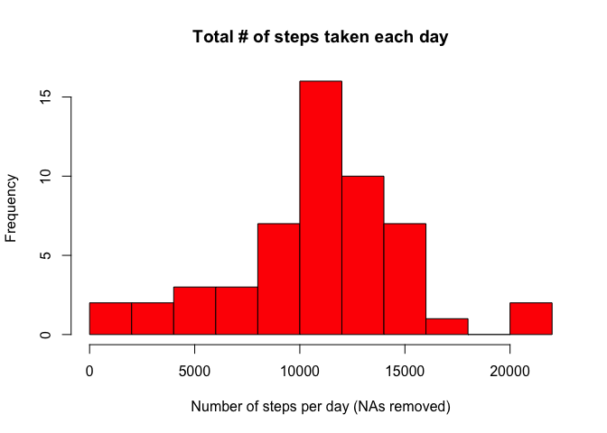
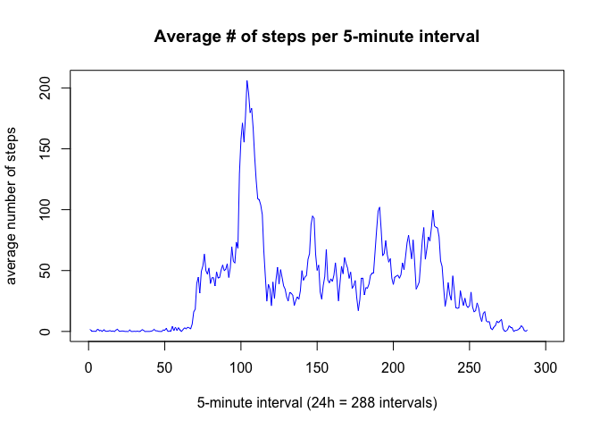
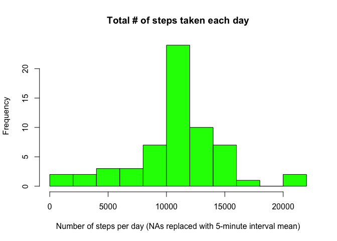
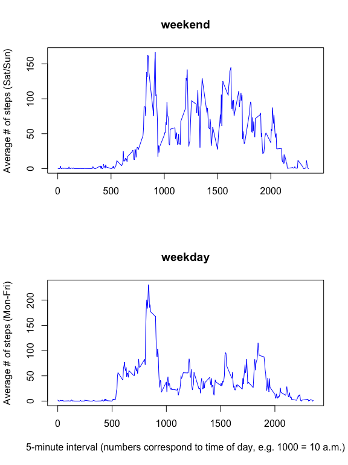

# Reproducible Research: Peer Assessment 1
submitted by: Googlehupf  
2015-10-18  
<br />
**Note: SET WORKING DIRECTORY TO SOURCE FILE LOCATION**
<br/>


## Loading and preprocessing the data
Read in the data with `read.csv()`:

```r
data <- read.csv("activity.csv", fileEncoding = "UTF-8")
```
No further preprocessing is necessary.

## What is the mean total number of steps taken per day?
We will use the `dplyr` package for performing the calculations:

```r
library(dplyr)
```
For this part of the assignment, NA values can be removed:

```r
valid.steps <- filter(data, !is.na(steps))
```
Now let's calculate the total number of steps taken each day. We group by date and sum the number of steps:

```r
steps.per.day <- valid.steps %>%
                        select(steps, date) %>%
                        group_by(date) %>%
                        summarise(sum.of.steps = sum(steps))
```
This code uses the piping function of ```dplyr``` for writing code chains that are easily readable.

Here is the histogram (the ```breaks``` argument has been set to make it look more smooth):

```r
hist(steps.per.day$sum.of.steps, 
     col = "red", 
     breaks = 12, 
     main = "Total # of steps taken each day", 
     xlab = "Number of steps per day (NAs removed)")
```

 

Calculating the mean and median total number of steps taken per day:

```r
steps.mean <- as.integer(mean(steps.per.day$sum.of.steps))  ## integer for plain text presentation
steps.median <- median(steps.per.day$sum.of.steps, na.rm = TRUE)
```
The total number of steps taken per day has a mean of ``10766``, and a median of ``10765``.


## What is the average daily activity pattern?
We now average the number of steps taken, per 5-minute interval, across all days. We reuse the subset of data with all NAs removed. 

Let's group the data by interval and then summarise by the mean of steps:

```r
interval.means <- valid.steps %>%
                        select(steps, interval) %>%
                        group_by(interval) %>%
                        summarise(mean.per.interval = mean(steps))
```

In the dataset, the 5-minute intervals are named with the corresponding time of day (e.g., the interval "1000" corresponds to 10 a.m.).

For the plot, and for the identification of the 5-minute interval with the maximum number of steps, we will instead use the index of the 288 intervals per day _(288 intervals * 5 minutes = 1440 minutes = 24h)_:

```r
interval.means$index <- c(1:nrow(interval.means))
```

We use this index for the x-axis in the time series plot:

```r
plot(interval.means$mean.per.interval ~ interval.means$index, 
     type = "l", 
     col = "blue", 
     main = "Average # of steps per 5-minute interval", 
     xlab = "5-minute interval (24h = 288 intervals)", 
     ylab = "average number of steps", 
     xlim = c(0, 300))
```

 

Next, we determine which 5-minute interval contains the maximum number of steps, and we record both its index number and the actual value (= time of day):

```r
max.steps <- which(interval.means$mean.per.interval == max(interval.means$mean.per.interval))
time.max.steps <- interval.means$interval[max.steps]
```
The interval with the maximum number of steps is ``104``, corresponding to a value of ``835``, i.e. 8:35h in the morning.


## Imputing missing values
The total number of rows with missing values can be calculated as:

```r
sum.na <- sum(is.na(data$steps))
```
and equals ``2304``.

Next, we need to impute these missing values.

**The devised strategy here is to replace NA values with the mean for their respective 5-minute interval.**  
We create a new dataset with the missing data filled in according to this strategy:

```r
data.NA.filledin <- data  ## copy original data
data.NA.filledin$interval.mean <- rep(interval.means$mean.per.interval, 61)  ## new column w/ interval means, known from analysing the average daily activity patterns (see above), for all 61 days in the dataset
data.NA.filledin$steps <- ifelse(is.na(data.NA.filledin$steps), data.NA.filledin$interval.mean, data.NA.filledin$steps)  ## if steps = NA, replace w/ interval mean from the new column
```

With the new dataset, we make a new histogram of the number of steps taken each day:

```r
## as before, group by date and sum the number of steps:
steps.per.day.NA.filledin <- data.NA.filledin %>%
        select(steps, date) %>%
        group_by(date) %>%
        summarise(sum.of.steps = sum(steps))

## plot:
hist(steps.per.day.NA.filledin$sum.of.steps, 
     col = "green", 
     breaks = 12, 
     main = "Total # of steps taken each day", 
     xlab = "Number of steps per day (NAs replaced with 5-minute interval mean)")
```

 

We also calculate the mean and median for the new dataset:

```r
steps.mean.NA.filledin <- as.integer(mean(steps.per.day.NA.filledin$sum.of.steps))
steps.median.NA.filledin <- median(steps.per.day.NA.filledin$sum.of.steps)
```

Let's compare the results:

```r
comparison <- matrix(c(steps.mean, steps.mean.NA.filledin, steps.median, steps.median.NA.filledin), ncol=2, byrow=TRUE)
colnames(comparison) <- c("NA removed", "NA replaced w/ interval mean")
rownames(comparison) <- c("mean", "median")
as.table(comparison)
```

```
##        NA removed NA replaced w/ interval mean
## mean     10766.00                     10766.00
## median   10765.00                     10766.19
```
In this case, the imputation of missing values showed no noticable effect. This is due to the strategy of replacing NA values with their 5-minute interval mean. A different strategy such as replacing NA with a day mean, or with values from other rows, might lead to different results.


## Are there differences in activity patterns between weekdays and weekends?
We use the ```chron``` package to create a logical variable _weekend_ (TRUE / FALSE). The result is equivalent to a factor with two levels "weekday" and "weekend":

```r
library(chron)
data.NA.filledin$weekend <- chron::is.weekend(data.NA.filledin$date)
```

We can now compare the average number of steps taken per 5-minute time interval, making a time series plot that separately shows weekends and weekdays:

```r
## group the data by weekend and then interval, then take the mean of steps
weekday.means <- data.NA.filledin %>%
        select(steps, interval, weekend) %>%
        group_by(weekend, interval) %>%
        summarise(mean.per.weekday = mean(steps))

## separate weekends and weekdays
weekend <- filter(weekday.means, weekend == TRUE)
weekday <- filter(weekday.means, weekend == FALSE)

## time series plot
par(mfrow = c(2, 1))
plot(weekend$mean.per.weekday ~ weekend$interval, 
     type = "l", 
     col = "blue", 
     main = "weekend", 
     xlab = "", 
     ylab = "Average # of steps (Sat/Sun)", 
     xlim = c(0, 2400))
plot(weekday$mean.per.weekday ~ weekday$interval, 
     type = "l", 
     col = "blue", 
     main = "weekday", 
     xlab = "5-minute interval (numbers correspond to time of day, e.g. 1000 = 10 a.m.)", 
     ylab = "Average # of steps (Mon-Fri)")
```

 

As we can see, the activity patterns clearly differ between weekends and weekdays. In particular, more steps are taken on weekends in the time between roughly 10 a.m. and 8 p.m.
